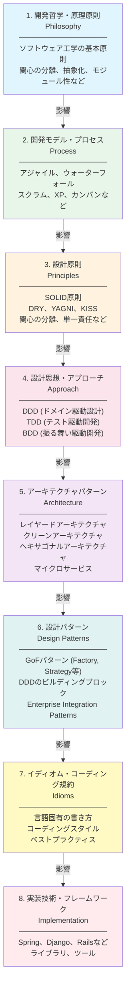

ソフトウェア開発の完全な階層構造

```mermaid
graph TD
    A["1. 開発哲学・原理原則<br/>Philosophy<br/>─────────────────<br/>ソフトウェア工学の基本原則<br/>関心の分離、抽象化、モジュール性など"]
    
    B["2. 開発モデル・プロセス<br/>Process<br/>─────────────────<br/>アジャイル、ウォーターフォール<br/>スクラム、XP、カンバンなど"]
    
    C["3. 設計原則<br/>Principles<br/>─────────────────<br/>SOLID原則<br/>DRY、YAGNI、KISS<br/>関心の分離、単一責任など"]
    
    D["4. 設計思想・アプローチ<br/>Approach<br/>─────────────────<br/>DDD (ドメイン駆動設計)<br/>TDD (テスト駆動開発)<br/>BDD (振る舞い駆動開発)"]
    
    E["5. アーキテクチャパターン<br/>Architecture<br/>─────────────────<br/>レイヤードアーキテクチャ<br/>クリーンアーキテクチャ<br/>ヘキサゴナルアーキテクチャ<br/>マイクロサービス"]
    
    F["6. 設計パターン<br/>Design Patterns<br/>─────────────────<br/>GoFパターン (Factory, Strategy等)<br/>DDDのビルディングブロック<br/>Enterprise Integration Patterns"]
    
    G["7. イディオム・コーディング規約<br/>Idioms<br/>─────────────────<br/>言語固有の書き方<br/>コーディングスタイル<br/>ベストプラクティス"]
    
    H["8. 実装技術・フレームワーク<br/>Implementation<br/>─────────────────<br/>Spring、Django、Railsなど<br/>ライブラリ、ツール"]
    
    A -->|影響| B
    B -->|影響| C
    C -->|影響| D
    D -->|影響| E
    E -->|影響| F
    F -->|影響| G
    G -->|影響| H
    
    style A fill:#e1f5ff
    style B fill:#e8f5e9
    style C fill:#fff3e0
    style D fill:#fce4ec
    style E fill:#f3e5f5
    style F fill:#e0f2f1
    style G fill:#fff9c4
    style H fill:#ffebee
```