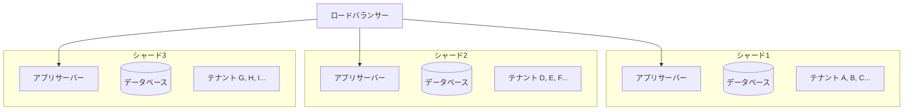
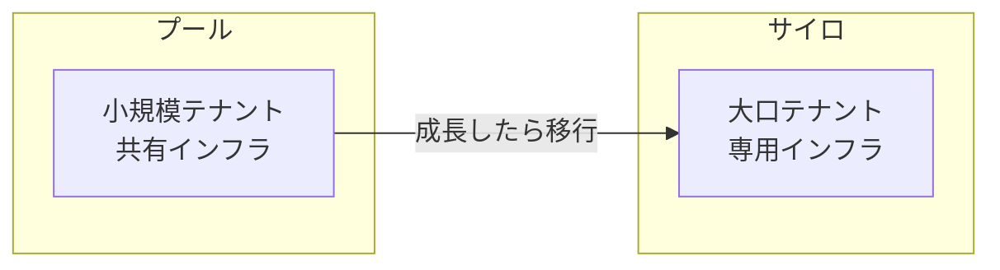
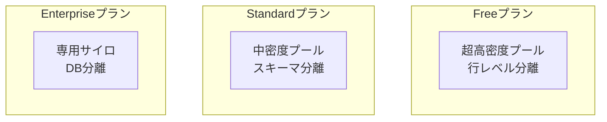
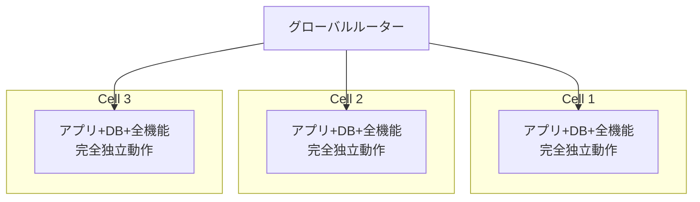
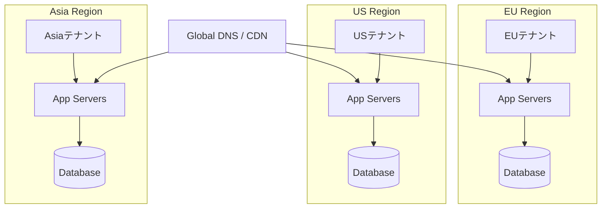
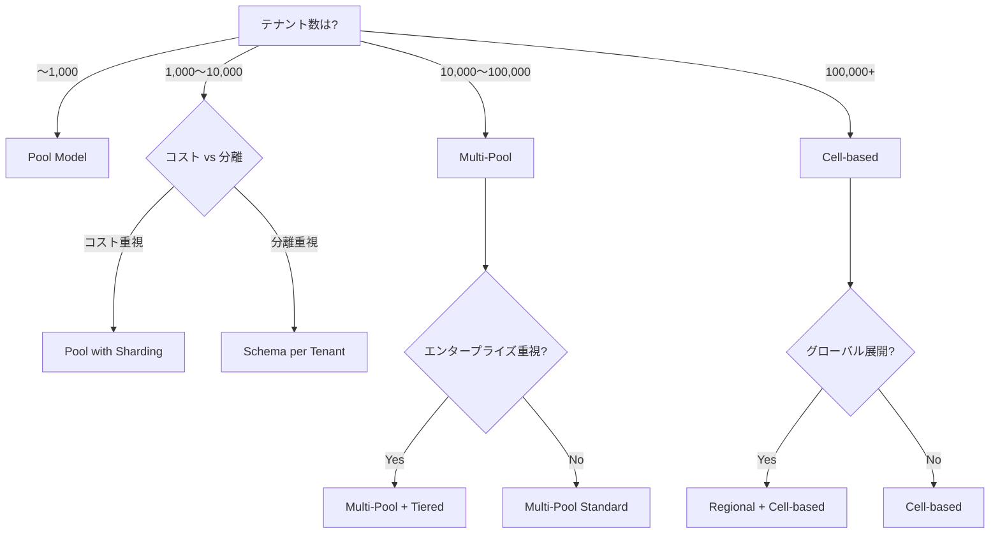

## はじめに

本シリーズ第2弾では、マルチテナントアーキテクチャの**応用的なパターン**と、Salesforce、Slack、Shopifyなどの**実例**を見ていきます。

**シリーズ構成：**
- [第1弾](リンク): 基礎概念編 - マルチテナントの基本とデータ分離戦略
- **第2弾（本記事）**: 応用モデル編 - 発展的なアーキテクチャパターンと実例
- 第3弾: 実装・設計編 - 分散戦略とGCP実装例

第1弾で学んだPool/Siloモデルを基に、さらに発展的なアーキテクチャを理解していきましょう。

---

## 応用・発展モデル

実際の大規模SaaSでは、基本モデル（Pool/Silo）を組み合わせた、より洗練されたアーキテクチャが採用されています。

### Multi-Pool Model（マルチプールモデル）

複数のプール（シャード、Pod）を用意し、テナントを分散配置するモデルです。



#### メリット

- **爆発半径が小さい** - 1シャードに問題が起きても他は無事
- **コスト効率が良い** - 完全なサイロより圧倒的に安い
- **段階的スケール** - テナント増加に応じてシャード追加

#### デメリット

- **運用の複雑さ** - 複数のDBを管理
- **テナント配置問題** - どのシャードに入れるか判断が必要
- **クロスシャードクエリ** - 複数シャードにまたがる集計が困難

#### テナント配置戦略

**1. ラウンドロビン**
```
テナント1 → シャードA
テナント2 → シャードB
テナント3 → シャードC
テナント4 → シャードA（最初に戻る）
```
シンプルだが負荷を考慮しない

**2. 負荷ベース配置**
```python
def assign_shard(tenant):
    # 最も負荷の低いシャードを選択
    shard = get_least_loaded_shard()
    return shard
```

**3. 地理的配置**
```
日本企業 → Asia Shard
米国企業 → US Shard
欧州企業 → EU Shard
```

#### 使いどころ

- 中〜大規模SaaS（1,000〜100,000テナント）
- 負荷分散とコストのバランス重視

---

### Bridge Model（ブリッジモデル）

基本はプールだが、特定テナントだけサイロに「橋渡し」できるモデルです。



#### 特徴

- **成長パスが明確** - スタートアップから大企業まで対応
- **柔軟な価格設定** - プラン変更でインフラも変わる
- **段階的移行** - ダウンタイム最小で移行可能

#### 使いどころ

- 顧客の成長を見込むSaaS
- Free → Pro → Enterprise のような階層プラン

---

### Tiered Model（階層型モデル）

プラン・ティアごとに異なるアーキテクチャを使用するモデルです。



#### 実装例

```yaml
# テナント配置ルール
tenant_placement:
  free_tier:
    model: shared_database
    max_tenants_per_shard: 10000
    
  standard_tier:
    model: schema_per_tenant
    max_tenants_per_shard: 1000
    
  enterprise_tier:
    model: database_per_tenant
    dedicated_infrastructure: true
```

#### 使いどころ

- SaaS料金プランとアーキテクチャを連動
- 明確な差別化が必要な場合

---

### Cell-based Architecture（セルベース）

小さな独立したユニット（セル）を複数作成し、各セルが完全に自己完結するモデルです。



#### Multi-Poolとの違い

| 項目 | Multi-Pool | Cell-based |
|------|-----------|-----------|
| **独立性** | データ層のみ分離 | 全レイヤー独立 |
| **障害影響** | 同シャードのテナント | 同セルのテナント |
| **デプロイ** | 全体で一斉 | セル単位で可能 |
| **コスト** | 低い | やや高い |

#### 使いどころ

- 超大規模サービス（100,000+テナント）
- 障害隔離を最重視（Netflix、Amazonなど）
- マイクロサービスアーキテクチャ

---

### Regional Model（リージョナルモデル）

地理的な場所ごとにプールを配置するモデルです。



#### メリット

- **データ主権対応** - GDPR、データローカライゼーション
- **レイテンシ最適化** - ユーザーに近いリージョンで処理
- **災害対策** - リージョン間フェイルオーバー

#### 使いどころ

- グローバル展開SaaS
- 規制対応が必要な業界

---

### その他の応用モデル

#### Pod-based Model（ポッドベース）
- テナントごとに専用のKubernetes Podを起動
- コンテナ環境に最適
- 動的スケーリングが容易

#### Federated Model（フェデレーション）
- 複数の独立したシステムを論理的に統合
- M&A後のシステム統合に有効
- API経由で各システムを連携

#### Serverless Multi-tenant
- Lambda、Fargate等で関数/コンテナを共有
- イベント駆動アーキテクチャ
- コスト効率が極めて高い

---

## 用語の整理

マルチテナントアーキテクチャには、似たような意味で使われる用語がたくさんあります。正確に理解しましょう。

### Shard（シャード）vs Pod vs Cluster

これらは**ほぼ同じ概念**を指す場合が多いです：

**「複数テナントを収容する、独立したインフラユニット」**

しかし、ニュアンスが異なります。

#### Shard（シャード）

- **元の意味**: データベースの水平分割
- **強調点**: データの分散
- **視点**: 「データをどう分けるか」
- **よく使うサービス**: Slack, MongoDB

**例**:
```
Shard 1: テナントA, B, C のデータ
Shard 2: テナントD, E, F のデータ
Shard 3: テナントG, H, I のデータ
```

---

#### Pod

- **元の意味**: 「さや」「ポッド」（独立したユニット）
- **強調点**: 環境全体の独立性
- **視点**: 「完全に分離された環境」
- **よく使うサービス**: Salesforce, Shopify

**例**:
```
Pod NA123:
├── アプリケーションサーバー
├── データベースクラスター
├── ストレージ
├── キャッシュ
└── テナント: 10,000+
```

**注意**: Kubernetesの「Pod」とは**完全に別物**です！

---

#### Cluster

- **元の意味**: 「クラスター」「集まり」
- **強調点**: リソースのグループ化
- **視点**: インフラやDBのグループ
- **用途**: 一般的な用語

---

### Kubernetes PodとマルチテナントPodの違い

混同しやすいので明確にしておきましょう。

| 項目 | Kubernetes Pod | マルチテナント Pod |
|------|---------------|-------------------|
| **粒度** | コンテナ | データセンター規模 |
| **寿命** | 秒〜時間 | 月〜年 |
| **含むもの** | 1-数個のコンテナ | DB/App/Storage全部 |
| **管理** | K8sが自動 | 運用チームが手動 |
| **テナント数** | 通常1 | 数千〜数万 |
| **障害範囲** | 1コンテナ | 数千テナント |

**実務での使い分け**:
- GKE/EKS使用時 → K8s Podは「Pod」、マルチテナント単位は「Cluster」「Shard」
- K8s未使用時 → 「Pod」= インフラの大単位として使用可能

---

### シャーディングの2つの意味

「シャーディング」という用語も、文脈によって意味が異なります。

#### 1. データベースシャーディング（狭義）

```
テナントA, B, C → DB Shard 1
テナントD, E, F → DB Shard 2
```

**データベースだけ**を分割

---

#### 2. インフラシャーディング（広義）

```
Shard 1:
├── アプリサーバー
├── データベース
└── テナント A, B, C

Shard 2:
├── アプリサーバー
├── データベース
└── テナント D, E, F
```

**インフラ全体**を分割

実務では**広義**で使われることが多いです。

---

## 実例から学ぶ

大手SaaSがどのようなアーキテクチャを採用しているか見ていきましょう。

### Salesforce

**モデル**: Cell-based (Pod Architecture)

#### アーキテクチャ詳細

- 「Pod」と呼ばれる独立したユニットを使用
- 各Podは完全に独立した環境（DB、アプリサーバー含む）
- 1つのPodに数千〜数万のOrg（テナント）が同居
- 超大規模顧客には専用Podを提供することも
- 世界中に数百のPod

#### 技術的特徴

- マルチテナントDB設計の先駆者
- メタデータ駆動アーキテクチャ
- 単一の共有スキーマに全テナントのデータ
- 独自のクエリオプティマイザで各テナントの可視性を考慮

**参考資料**:
- [Platform Multitenant Architecture | Salesforce Architects](https://architect.salesforce.com/fundamentals/platform-multitenant-architecture)
- [Salesforce Architecture Essentials | Trailhead](https://trailhead.salesforce.com/content/learn/modules/starting_force_com/starting_understanding_arch)

---

### Slack

**モデル**: Multi-Pool (Shard-based) + Tiered

#### アーキテクチャ詳細

- ワークスペース（テナント）をシャードに分散
- 小規模ワークスペース → 高密度シャード
- 大規模エンタープライズ → 専用シャードまたは専用インフラ
- シャードはDBとアプリケーションの両方を含む

#### 技術スタック

- **データベース**: PostgreSQL
- **シャーディング層**: Vitess（YouTubeで開発されたMySQL/PostgreSQLのシャーディングシステム）
- **データ分離**: workspace_idでシャーディング

#### 進化の歴史

```
2013年頃: 単一DB
    ↓
2015年頃: データベースシャーディング開始
    ↓
2018年頃: Vitess導入で動的シャード管理
    ↓
現在: 高度なマルチシャードアーキテクチャ
```

**参考資料**:
- [How Slack Built Shared Channels | Slack Engineering](https://slack.engineering/how-slack-built-shared-channels/)
- [Security practices | Slack](https://slack.com/intl/en-au/policy-archives/security/2021-10-01)

---

### GitHub

**モデル**: Massive Pool + Database Sharding

#### アーキテクチャ詳細

- 基本は巨大なプール
- データベースは機能別・垂直シャーディング
  - リポジトリ、Issue、PRなど機能ごとに分散
- Vitessを使用した動的シャード管理
- Enterprise顧客向けに「GitHub Enterprise Server」も提供

#### シャーディング戦略

```
mysql1 (メインクラスター)
├── users, repositories
├── issues, pull_requests
└── 従来の主要テーブル

cluster_a
├── statuses（垂直分割）
└── 高頻度アクセステーブル

cluster_b
├── actions（CI/CD関連）
└── 特定機能のテーブル
```

**参考資料**:
- [Partitioning GitHub's relational databases | GitHub Blog](https://github.blog/2021-09-27-partitioning-githubs-relational-databases-scale/)

---

### Shopify

**モデル**: Multi-Pool (Pod-based)

#### アーキテクチャ詳細

- 「Shop」（テナント）をPodに分散配置
- 各Podは完全に独立したMySQL、Redis、Memcachedを持つ
- Podは地理的・負荷的に分散
- 大規模商店には専用Podを割り当て可能

#### Pod構成

```
Pod 1:
├── MySQL Shard
├── Redis
├── Memcached
└── Shop A, B, C... (500-1000店舗)

Pod 2:
├── MySQL Shard
├── Redis
├── Memcached
└── Shop D, E, F... (500-1000店舗)
```

#### スケーリングの歴史

```
2004年: 単一DB
    ↓
2015年: データベースシャーディング開始
    ↓
2016年: Pod Architectureへ移行
    ↓
現在: 数百のPodで世界中のマーチャントをサポート
```

#### 特徴的な仕組み

**Sorting Hat**: 負荷分散システム
- リクエストを適切なPodにルーティング
- shop_idベースでPodを判定

**Pod Balancer**: 動的再配置
- 大規模店舗を専用Podに移動
- 負荷均等化のための自動リバランシング

**参考資料**:
- [A Pods Architecture To Allow Shopify To Scale | Shopify Engineering](https://shopify.engineering/a-pods-architecture-to-allow-shopify-to-scale)
- [Shard Balancing: Moving Shops with Zero-Downtime | Shopify Engineering](https://shopify.engineering/mysql-database-shard-balancing-terabyte-scale)

---

### Stripe

**モデル**: Multi-Pool + Tiered

#### アーキテクチャ詳細

- アカウント（テナント）を複数のデータベースクラスターに分散
- 高トランザクション顧客には専用リソース
- PCI DSS対応のため、データ分離に特に注意
- 金融トランザクションの整合性を最優先

**参考**: Stripeは詳細なアーキテクチャを公開していませんが、業界標準のマルチプール+階層型モデルを採用

---

### Google Workspace

**モデル**: Massive Pool + Sharding

#### アーキテクチャ詳細

- 世界最大級のマルチテナントシステム
- ユーザーデータを複数のシャードに分散
- 独自の分散データベース技術
  - Bigtable: NoSQL、大規模データストア
  - Spanner: グローバル分散SQL
- 「Organization」（テナント）単位だが、内部は超高密度プール

**参考資料**:
- [Spanner: Google's Globally Distributed Database | Google Research](https://research.google/pubs/pub39966/)

---

## 規模別の選択パターン

実際のSaaSの成長に合わせたアーキテクチャ選択のパターンです。

### スタートアップ期（〜1,000テナント）

**推奨モデル**: Pool Model（単一プール）

**例**:
- GitHub初期
- 多くのスタートアップ

**特徴**:
- シンプルで管理しやすい
- コスト最小
- 素早い機能開発が可能

---

### 成長期（1,000〜100,000テナント）

**推奨モデル**: Multi-Pool / Sharding

**例**:
- Slack
- Shopify
- Zendesk

**特徴**:
- 段階的なスケール
- 負荷分散
- 障害範囲の限定

---

### 超大規模（100,000+テナント）

**推奨モデル**: Cell-based or Massive Pool + Advanced Sharding

**例**:
- Salesforce
- Google Workspace
- Netflix（視聴者を「テナント」と見なした場合）

**特徴**:
- 完全な障害隔離
- グローバル分散
- 独自の最適化技術

---

### エンタープライズ重視

**推奨モデル**: Hybrid (Pool + Silo)

**例**:
- Atlassian（Jira Cloud + Jira Data Center）
- HubSpot
- Stripe

**特徴**:
- 一般顧客はPool
- 大口顧客はSilo
- 柔軟な価格設定

---

## アーキテクチャ選択のフローチャート



---

## まとめ

第2弾では、応用的なアーキテクチャパターンと実例を学びました。

**重要ポイント**:

1. **Multi-Pool Model**が中規模SaaSの主流
2. **Cell-based**は超大規模向け、完全な障害隔離
3. **用語の理解が重要**: Shard = データ分割、Pod = 環境分割
4. **K8s PodとマルチテナントPodは別物**
5. 大手SaaSはそれぞれの成長に合わせてアーキテクチャを進化させている

**規模別推奨**:
- 〜1K: Pool
- 1K〜100K: Multi-Pool
- 100K+: Cell-based
- Enterprise重視: Hybrid

**次回予告**:
第3弾では、アプリケーション層とデータ層の**分散戦略の組み合わせ**、**GCPでの具体的な実装例**、そして**スケーリング戦略**を詳しく見ていきます！

---

## 参考文献

### 公式ドキュメント・ブログ

- [Salesforce Platform Multitenant Architecture | Salesforce Architects](https://architect.salesforce.com/fundamentals/platform-multitenant-architecture)
- [Salesforce Architecture Essentials | Trailhead](https://trailhead.salesforce.com/content/learn/modules/starting_force_com/starting_understanding_arch)
- [How Slack Built Shared Channels | Slack Engineering](https://slack.engineering/how-slack-built-shared-channels/)
- [Slack Security Practices](https://slack.com/intl/en-au/policy-archives/security/2021-10-01)
- [Partitioning GitHub's relational databases | GitHub Blog](https://github.blog/2021-09-27-partitioning-githubs-relational-databases-scale/)
- [A Pods Architecture To Allow Shopify To Scale | Shopify Engineering](https://shopify.engineering/a-pods-architecture-to-allow-shopify-to-scale)
- [Shard Balancing at Shopify | Shopify Engineering](https://shopify.engineering/mysql-database-shard-balancing-terabyte-scale)

### 技術記事・論文

- [Spanner: Google's Globally Distributed Database | Google Research](https://research.google/pubs/pub39966/)
- [Data Isolation and Sharding Architectures for Multi-Tenant Systems | Medium](https://medium.com/@justhamade/data-isolation-and-sharding-architectures-for-multi-tenant-systems-20584ae2bc31)