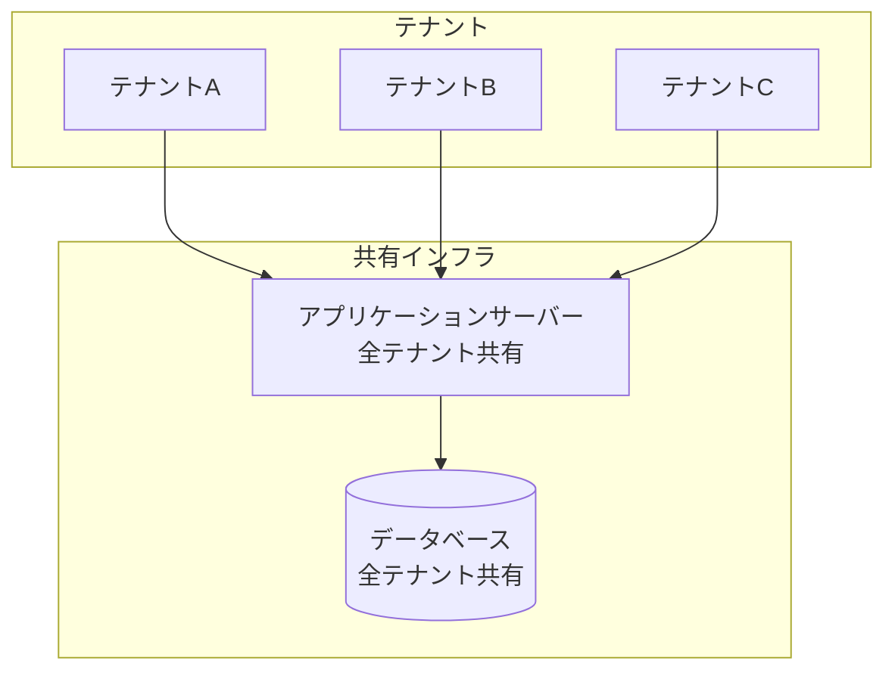
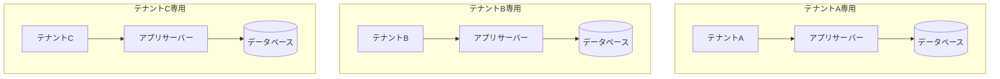
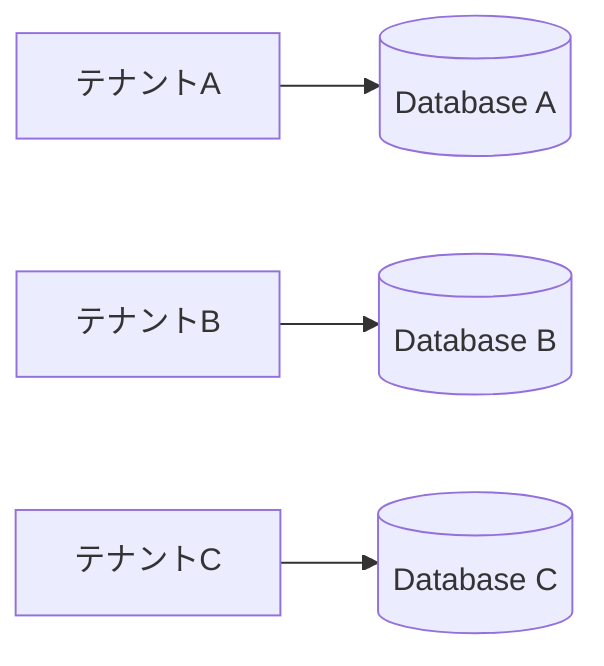
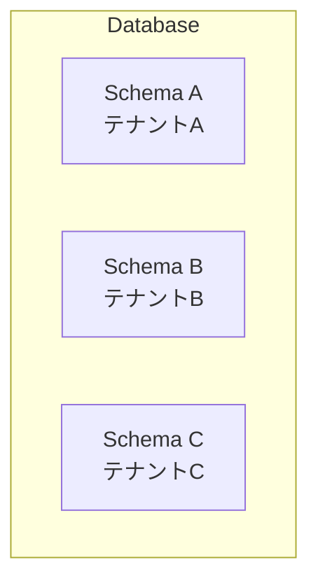
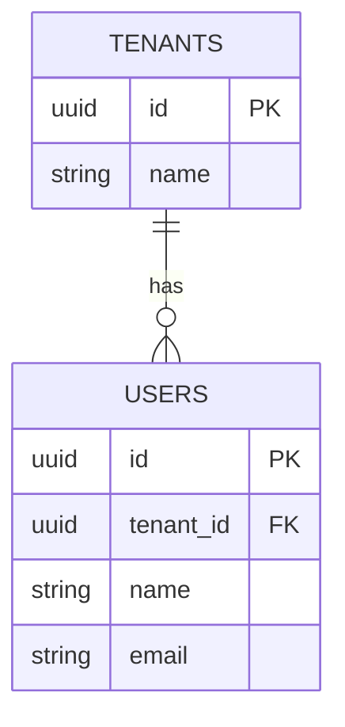

## はじめに

SaaSを構築する際、避けて通れないのが「マルチテナント」の設計です。1つのアプリケーションで複数の顧客（テナント）を効率的にサポートするには、適切なアーキテクチャモデルの選択が重要です。

本シリーズでは、マルチテナントアーキテクチャについて3部作で解説します。

- **第1弾（本記事）**: 基礎概念編 - マルチテナントの基本とデータ分離戦略
- **第2弾**: 応用モデル編 - 発展的なアーキテクチャパターンと実例
- **第3弾**: 実装・設計編 - 分散戦略とGCP実装例

まずは第1弾として、マルチテナントの基礎概念から学んでいきましょう。

---

## マルチテナントとは

**マルチテナント**とは、1つのアプリケーションを複数の顧客（テナント）で共有するアーキテクチャです。

例えば、SlackやSalesforceを使っているとき：
- あなたの会社のデータ
- 他の何千社のデータ

これらが**同じアプリケーション、同じサーバー上で動いている**のです。しかし、他社のデータは見えませんし、お互いに影響し合いません。

### シングルテナントとの違い

対照的に**シングルテナント**は、顧客ごとに専用のアプリケーションインスタンスを用意します。A社用、B社用...と別々に運用する形です。

### 用語の関係性

実務では以下のような対応関係がよく見られます：

```
マルチテナント ≒ プールモデル（共有型）
シングルテナント ≒ サイロモデル（専用型）
```

ただし、これは厳密な定義ではなく、**マルチテナントの中にもサイロモデルを採用するケース**（各テナントに専用DBを割り当てるなど）もあります。一般的には：

- **マルチテナント** = 「テナント間でリソースを共有する」という概念
- **プールモデル** = その実装方式の一つ

として理解するのが適切です。

### なぜSaaSでマルチテナントが主流なのか

**コスト効率が圧倒的に違う**からです。

- 1つのシステムを管理すればよい
- サーバーリソースを共有できる
- アップデートやバグ修正が一度で全顧客に適用される
- スケールメリットを活かせる

---

## 基本モデル

マルチテナントアーキテクチャには大きく2つの基本モデルがあります。

### Pool Model（プールモデル）

複数テナントが同一のインフラリソースを共有するモデルです。



#### メリット

- **コスト効率最高** - サーバー、DB、ストレージをシェア
- **運用がシンプル** - 管理するインフラが1つ（または少数）
- **リソース活用率が高い** - Aさんが使ってない時、Bさんが使える
- **機能追加やバグ修正が一発** - 全テナントに即反映

#### デメリット

- **ノイジーネイバー問題** - 1つのテナントが暴れると全体に影響
- **セキュリティリスク** - 論理的分離だけなので、バグがあると漏洩リスク
- **カスタマイズ難しい** - 特定テナント向けの機能作りにくい
- **スケール限界** - 1つのリソースプールには上限がある

#### 使いどころ

- スタートアップ初期（〜1,000テナント）
- コスト優先
- 標準化されたサービス

---

### Silo Model（サイロモデル）

各テナントが専用のインフラリソースを持つモデルです。完全に物理的に分離されています。



#### メリット

- **完全な分離** - 他のテナントの影響を一切受けない
- **セキュリティが高い** - 物理的に別だから漏洩リスク低い
- **パフォーマンス予測可能** - 専用リソースだから安定
- **カスタマイズ自由** - テナントごとに違うバージョンもOK
- **コンプライアンス対応しやすい** - 金融・医療系で要求される場合

#### デメリット

- **コスト高い** - テナント数 × インフラコスト
- **運用が大変** - 100テナントなら100個のインフラ管理
- **リソース無駄** - 使ってない時も専用リソースが待機
- **アップデートが地獄** - 全テナント個別に適用必要
- **スケールが難しい** - テナント増えるほど指数関数的に運用負荷

#### 使いどころ

- エンタープライズ顧客
- 金融・医療など規制が厳しい業界
- 高いセキュリティ要求

---

### Pool vs Silo 比較表

| 観点 | Pool Model | Silo Model |
|------|-----------|-----------|
| **コスト** | 低い | 高い |
| **運用負荷** | 低い | 高い |
| **セキュリティ** | 論理的分離 | 物理的分離 |
| **カスタマイズ性** | 低い | 高い |
| **スケーラビリティ** | 限界あり | 柔軟 |
| **ノイジーネイバー** | リスクあり | なし |
| **主な用途** | 一般SaaS | エンタープライズ |

---

## データ分離戦略

デプロイメントモデル（Pool/Silo）とは別に、**データをどう分離するか**という戦略があります。これは特にプールモデルで重要です。

### 1. Database per Tenant（DB分離）

各テナントが完全に別のデータベースを持ちます。



#### メリット
- **完全な分離** - 最高レベルのセキュリティ
- **バックアップ・リストアが独立** - テナント単位で操作可能
- **パフォーマンス測定が容易** - テナント別に明確
- **スケールアウトしやすい** - テナントを別サーバーに移動しやすい

#### デメリット
- **コスト高** - DB接続数、ライセンス費用が膨大
- **運用複雑** - スキーマ変更を全DBに適用する必要
- **クロステナント集計困難** - データが物理的に分散

#### SQL例
```sql
-- 各テナントが独立したデータベース
USE tenant_a_db;
SELECT * FROM users WHERE id = ?;

USE tenant_b_db;
SELECT * FROM users WHERE id = ?;
```

---

### 2. Schema per Tenant（スキーマ分離）

1つのデータベース内で、各テナントが専用のスキーマを持ちます。



#### メリット
- **DBは1つで管理が楽** - 接続プールを共有できる
- **データは物理的に分離** - セキュリティとパフォーマンスのバランス
- **バックアップは統合** - 運用コスト削減
- **スキーマ変更が一括適用可能** - マイグレーションツールで効率化

#### デメリット
- **スキーマ数の上限** - データベースによる制約
- **テナント移行がやや複雑** - スキーマごとの移動が必要
- **リソース競合の可能性** - 同一DB内での競合

#### SQL例（PostgreSQL）
```sql
-- スキーマ作成
CREATE SCHEMA tenant_a;
CREATE TABLE tenant_a.users (
    id SERIAL PRIMARY KEY,
    name VARCHAR(255),
    email VARCHAR(255)
);

-- 切り替え
SET search_path TO tenant_a;
SELECT * FROM users WHERE id = ?;

-- または明示的に
SELECT * FROM tenant_a.users WHERE id = ?;
```

---

### 3. Shared Database（行レベル分離）

全テナントが同じテーブルを使用し、各行に`tenant_id`カラムで区別します。



#### メリット
- **最もシンプル** - アプリケーション設計が直感的
- **コスト最小** - 単一DB、単一スキーマ
- **クロステナント集計が容易** - JOIN可能
- **スケールアップが簡単** - DB自体をスケール

#### デメリット
- **バグによる漏洩リスク最大** - WHERE句の付け忘れで他テナントのデータが見える
- **パフォーマンス懸念** - インデックス設計が重要
- **バックアップがテナント単位で不可** - 全体バックアップのみ

#### SQL例
```sql
-- すべてのクエリにtenant_idを含める
SELECT * FROM users 
WHERE tenant_id = ? AND id = ?;

-- INSERT時も必須
INSERT INTO users (tenant_id, name, email)
VALUES (?, ?, ?);

-- Row Level Security (PostgreSQL)
CREATE POLICY tenant_isolation ON users
    USING (tenant_id = current_setting('app.current_tenant')::uuid);

-- アプリケーションでテナントを設定
SET app.current_tenant = 'テナントAのUUID';
SELECT * FROM users WHERE id = ?; -- 自動的にtenant_idでフィルタ
```

#### セキュリティ対策

**アプリケーション層での強制**
```ruby
# Rails例: デフォルトスコープ
class User < ApplicationRecord
  belongs_to :tenant
  default_scope { where(tenant_id: Current.tenant_id) }
end

# ミドルウェアでテナント設定
class TenantMiddleware
  def call(env)
    tenant = extract_tenant_from_request(env)
    Current.tenant_id = tenant.id
    @app.call(env)
  end
end
```

---

### データ分離戦略の選び方

| 戦略 | コスト | セキュリティ | 運用負荷 | 使いどころ |
|------|--------|------------|---------|-----------|
| **DB分離** | 高 | 最高 | 高 | 金融、医療、大規模エンタープライズ |
| **スキーマ分離** | 中 | 高 | 中 | 中規模SaaS、バランス重視 |
| **行レベル分離** | 低 | 中 | 低 | スタートアップ、小規模、標準化サービス |

### 実務での選択基準

```
テナント数が少ない（〜100）
　→ DB分離も検討可能

テナント数が中規模（100〜10,000）
　→ スキーマ分離が最適

テナント数が大規模（10,000+）
　→ 行レベル分離 + 後述のシャーディング
```

---

## ハイブリッドアプローチ

実際の大規模SaaSでは、複数の戦略を**組み合わせる**ケースが多いです。

### 例1: 階層型データ分離

```
- 無料プラン → 行レベル分離（超高密度）
- Standardプラン → スキーマ分離
- Enterpriseプラン → DB分離
```

### 例2: データの性質で分ける

```
- ユーザー・認証データ → 行レベル分離（高速アクセス必要）
- ビジネスデータ → スキーマ分離
- 大容量ファイル → オブジェクトストレージ（tenant_id付きパス）
```

---

## セキュリティのベストプラクティス

### 1. 多層防御

```
┌─────────────────────────┐
│ 1. API Gateway          │ ← 認証・認可
├─────────────────────────┤
│ 2. Application Layer    │ ← tenant_id検証
├─────────────────────────┤
│ 3. ORM/Query Builder    │ ← デフォルトスコープ
├─────────────────────────┤
│ 4. Database             │ ← Row Level Security
└─────────────────────────┘
```

### 2. 監査ログ

```sql
CREATE TABLE audit_logs (
    id SERIAL PRIMARY KEY,
    tenant_id UUID NOT NULL,
    user_id UUID NOT NULL,
    action VARCHAR(50),
    table_name VARCHAR(100),
    record_id UUID,
    created_at TIMESTAMP DEFAULT NOW()
);

-- 全てのデータアクセスを記録
```

### 3. 定期的なセキュリティテスト

- **Penetration Testing**: 他テナントのデータにアクセスできないか
- **Code Review**: WHERE句漏れのチェック
- **自動テスト**: 全APIエンドポイントでtenant_id検証

---

## まとめ

第1弾では、マルチテナントアーキテクチャの基礎を学びました。

**重要ポイント**:
1. **マルチテナント ≒ プールモデル**（共有型）、**シングルテナント ≒ サイロモデル**（専用型）
2. Pool Modelはコスト効率が高いが、ノイジーネイバー問題がある
3. Silo Modelは完全分離だが、コストと運用負荷が高い
4. データ分離戦略は3つ：DB分離、スキーマ分離、行レベル分離
5. 実際は**ハイブリッド**で使い分けることが多い

**次回予告**:
第2弾では、Multi-Pool、Cell-based、Regional Modelなどの**応用的なアーキテクチャパターン**と、Salesforce、Slack、Shopifyなどの**実例**を詳しく見ていきます！

---

## 参考文献

- [Salesforce Platform Multitenant Architecture | Salesforce Architects](https://architect.salesforce.com/fundamentals/platform-multitenant-architecture)
- [Data Isolation and Sharding Architectures for Multi-Tenant Systems | Medium](https://medium.com/@justhamade/data-isolation-and-sharding-architectures-for-multi-tenant-systems-20584ae2bc31)
- [Multi-tenant SaaS database tenancy patterns | Microsoft Azure](https://learn.microsoft.com/en-us/azure/azure-sql/database/saas-tenancy-app-design-patterns)