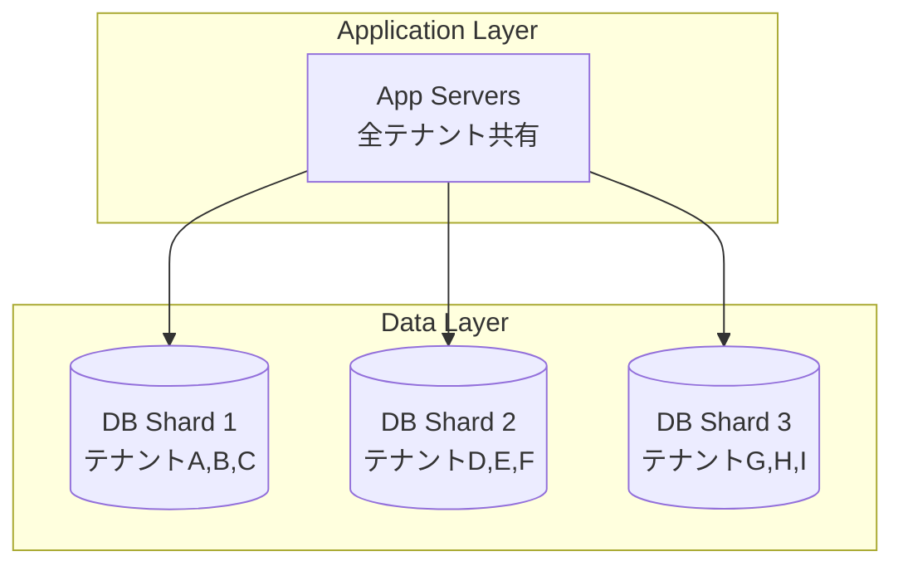
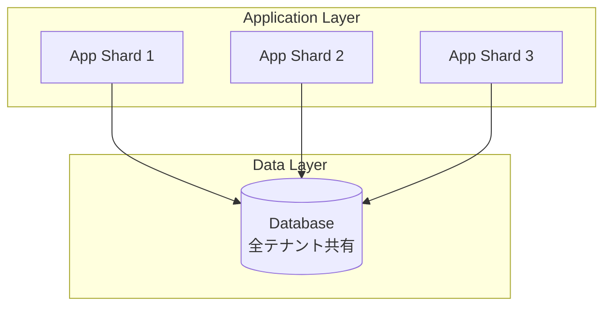
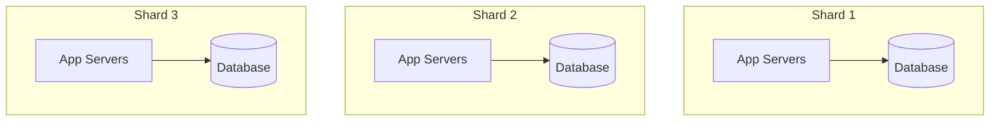
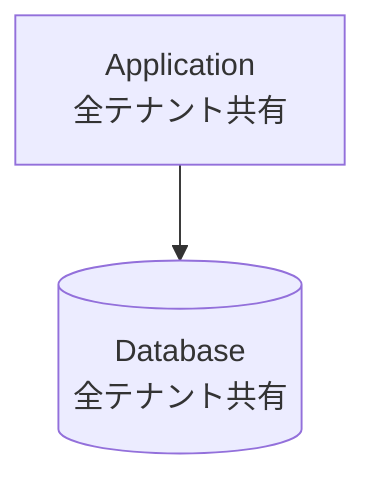
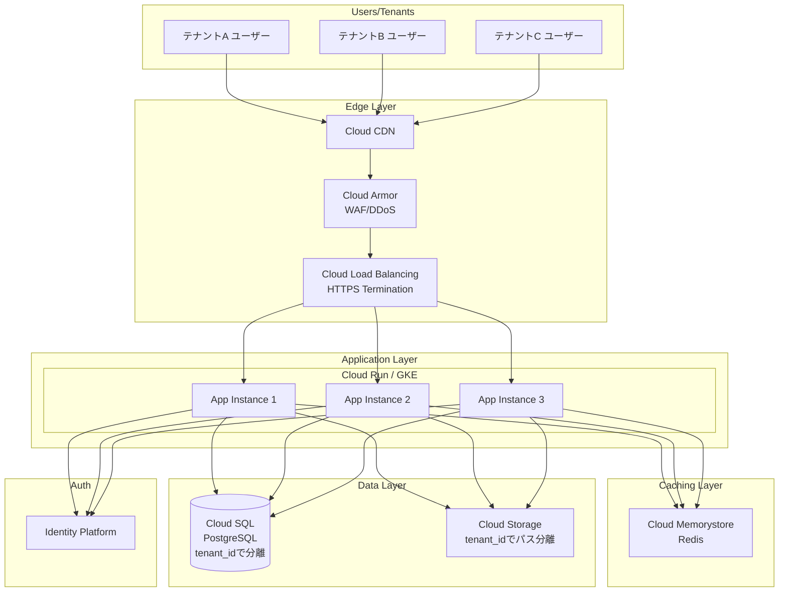
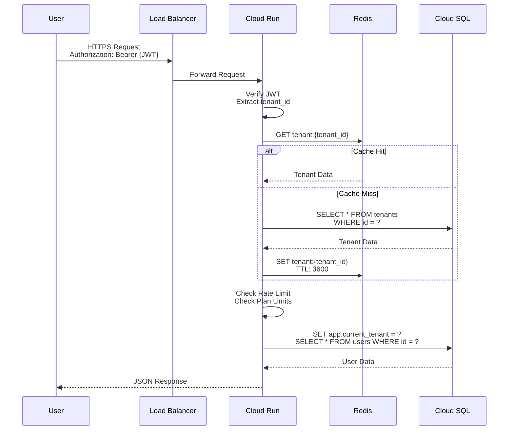

## はじめに

本シリーズ第3弾では、マルチテナントアーキテクチャの**実装戦略**と**GCPでの具体的な構築方法**を学びます。

**シリーズ構成：**
- [第1弾](リンク): 基礎概念編 - マルチテナントの基本とデータ分離戦略
- [第2弾](リンク): 応用モデル編 - 発展的なアーキテクチャパターンと実例
- **第3弾（本記事）**: 実装・設計編 - 分散戦略とGCP実装例

理論から実践へ。実際にシステムを構築する際のポイントを見ていきましょう。

---

## アプリケーション層とデータ層の独立した選択

重要な設計原則：**アプリケーション層とデータ層は独立して分散戦略を選べる**

多くの人が見落としがちですが、アプリとDBは**別々にスケール戦略を決められる**のです。

### パターン1: アプリ共有 + DB分離



#### メリット
- アプリはステートレスで水平スケール容易
- データは分離されセキュリティ確保
- 運用するアプリケーションサーバーが少ない

#### 使いどころ
- 多くのSaaS
- アプリケーションロジックは共通、データだけ分離したい

---

### パターン2: アプリ分離 + DB共有



#### メリット
- 計算リソース（CPU/メモリ）を分離
- ノイジーネイバー問題をアプリ層で解決
- DBは軽量な場合に有効

#### 使いどころ
- 計算集約型（動画変換、AI処理など）
- レンダリングサービス
- バッチ処理が重いサービス

---

### パターン3: アプリもDBも分離



#### メリット
- 完全な隔離
- 爆発半径を最小化
- シャード間の依存なし

#### 使いどころ
- Slack、Shopifyタイプ
- 完全な障害隔離が必要
- 中〜大規模SaaS

---

### パターン4: アプリもDBも完全共有



#### メリット
- 最もシンプル
- コスト最小
- 素早い開発

#### 使いどころ
- スタートアップ初期（〜1,000テナント）
- MVP段階
- コスト最優先

---

## ビジネス要件による選択マトリクス

| 要件 | アプリ層 | データ層 | 理由 |
|------|---------|---------|------|
| **セキュリティ最優先** | 共有可 | 分離必須 | データ漏洩リスク削減 |
| **コスト最優先** | 共有 | 共有 | リソース共有で最小コスト |
| **スケーラビリティ優先** | 分離 | 分離 | 独立スケール可能 |
| **レイテンシ最優先** | リージョン分離 | リージョン分離 | 地理的に近い配置 |
| **運用負荷削減** | 共有 | 分離 | 管理するアプリ数を最小化 |
| **計算集約型** | 分離 | 共有可 | CPU/メモリを分離 |

---

## 実例で見る分散戦略

### Slack
- **アプリ**: シャードごとに分離
- **DB**: シャードごとに分離（PostgreSQL + Vitess）
- **理由**: 
  - メッセージデータが巨大
  - リアルタイム性重視
  - ワークスペース間の完全隔離

**参考**: [Slack Engineering Blog](https://slack.engineering/how-slack-built-shared-channels/)

---

### GitHub
- **アプリ**: 基本は共有（プール）
- **DB**: 機能別に垂直シャーディング（Vitess）
- **理由**:
  - アプリはステートレス
  - DBが重い（リポジトリ、Issue、PR）
  - 機能ごとに負荷特性が異なる

**参考**: [GitHub Blog - Partitioning databases](https://github.blog/2021-09-27-partitioning-githubs-relational-databases-scale/)

---

### Stripe
- **アプリ**: 共有だがシャード認識
- **DB**: 顧客規模で分離
- **理由**:
  - トランザクション整合性
  - PCI DSS対応
  - 金融データの分離要件

---

## GCPでのプール型実装例

実際にGCPでマルチテナントSaaSを構築する場合の、具体的なアーキテクチャを見ていきましょう。

### 全体アーキテクチャ



---

### GCPサービスの選定理由

#### Edge Layer

**Cloud CDN**
- 静的コンテンツの配信
- グローバルなキャッシング
- レイテンシ削減

**Cloud Load Balancing**
- L7（アプリケーション層）負荷分散
- HTTPSターミネーション
- 複数リージョン対応

**Cloud Armor**
- WAF（Web Application Firewall）
- DDoS防御
- 地理的アクセス制限

---

#### Application Layer

**選択肢1: Cloud Run（推奨）**

```yaml
# service.yaml
apiVersion: serving.knative.dev/v1
kind: Service
metadata:
  name: multitenant-app
spec:
  template:
    spec:
      containers:
      - image: gcr.io/project/app:latest
        resources:
          limits:
            memory: 2Gi
            cpu: 2000m
        env:
        - name: DB_HOST
          value: /cloudsql/project:region:instance
```

**メリット**:
- フルマネージド、運用不要
- 自動スケール（0→1000+）
- リクエストベース課金
- サーバーレス体験

**使いどころ**:
- 小〜中規模SaaS
- 運用コスト削減優先

---

**選択肢2: GKE（Kubernetes）**

```yaml
# deployment.yaml
apiVersion: apps/v1
kind: Deployment
metadata:
  name: multitenant-app
spec:
  replicas: 3
  selector:
    matchLabels:
      app: multitenant-app
  template:
    metadata:
      labels:
        app: multitenant-app
    spec:
      containers:
      - name: app
        image: gcr.io/project/app:latest
        resources:
          requests:
            memory: "1Gi"
            cpu: "500m"
          limits:
            memory: "2Gi"
            cpu: "1000m"
```

**メリット**:
- より細かい制御
- 複雑なマイクロサービス対応
- カスタムネットワーキング

**使いどころ**:
- 大規模SaaS
- 複雑な要件

---

#### Caching Layer

**Cloud Memorystore (Redis)**

```python
# Python例
import redis

redis_client = redis.Redis(
    host='10.0.0.3',
    port=6379,
    decode_responses=True
)

# テナント情報キャッシュ
def get_tenant(tenant_id):
    cache_key = f"tenant:{tenant_id}"
    cached = redis_client.get(cache_key)
    
    if cached:
        return json.loads(cached)
    
    # DB から取得
    tenant = db.query("SELECT * FROM tenants WHERE id = %s", tenant_id)
    
    # キャッシュに保存（TTL: 1時間）
    redis_client.setex(cache_key, 3600, json.dumps(tenant))
    
    return tenant
```

**用途**:
- テナント情報キャッシュ
- セッション管理
- レート制限カウンター
- 一時データ

---

#### Data Layer

**Cloud SQL (PostgreSQL)**

```sql
-- テナントテーブル
CREATE TABLE tenants (
    id UUID PRIMARY KEY DEFAULT gen_random_uuid(),
    name VARCHAR(255) NOT NULL,
    plan VARCHAR(50) NOT NULL,
    created_at TIMESTAMP DEFAULT NOW()
);

-- ユーザーテーブル（行レベル分離）
CREATE TABLE users (
    id UUID PRIMARY KEY DEFAULT gen_random_uuid(),
    tenant_id UUID NOT NULL REFERENCES tenants(id),
    email VARCHAR(255) NOT NULL,
    name VARCHAR(255),
    created_at TIMESTAMP DEFAULT NOW()
);

-- インデックス（パフォーマンス最適化）
CREATE INDEX idx_users_tenant_id ON users(tenant_id);

-- Row Level Security (RLS)
ALTER TABLE users ENABLE ROW LEVEL SECURITY;

CREATE POLICY tenant_isolation ON users
    FOR ALL
    USING (tenant_id = current_setting('app.current_tenant')::uuid);
```

**設定例**:
- インスタンスタイプ: db-n1-standard-4（4vCPU, 15GB RAM）
- ストレージ: SSD、自動拡張
- 高可用性（HA）構成
- 自動バックアップ（毎日）
- Read Replica（読み取り負荷分散）

---

**Cloud Storage**

```python
# Python例
from google.cloud import storage

def upload_file(tenant_id, file_name, file_content):
    client = storage.Client()
    bucket = client.bucket('multitenant-files')
    
    # テナントごとのパス
    blob_path = f"{tenant_id}/{file_name}"
    blob = bucket.blob(blob_path)
    
    # アップロード
    blob.upload_from_string(file_content)
    
    return blob.public_url
```

**パス構造**:
```
gs://bucket-name/
├── tenant-a-uuid/
│   ├── file1.pdf
│   └── image.png
├── tenant-b-uuid/
│   ├── document.docx
│   └── photo.jpg
└── tenant-c-uuid/
    └── video.mp4
```

---

### リクエストフロー



---

### 認証・認可の実装

#### JWT トークンの構造

```json
{
  "sub": "user-uuid",
  "tenant_id": "tenant-uuid",
  "email": "user@example.com",
  "role": "admin",
  "plan": "enterprise",
  "exp": 1735689600
}
```

#### アプリケーションでの検証

```python
# Flask例
from flask import Flask, request, g
import jwt

app = Flask(__name__)

@app.before_request
def extract_tenant():
    # JWTトークンを検証
    token = request.headers.get('Authorization', '').replace('Bearer ', '')
    
    try:
        payload = jwt.decode(token, SECRET_KEY, algorithms=['HS256'])
        g.tenant_id = payload['tenant_id']
        g.user_id = payload['sub']
    except jwt.InvalidTokenError:
        return {'error': 'Invalid token'}, 401

@app.route('/api/users/<user_id>')
def get_user(user_id):
    # 自動的にtenant_idでフィルタ
    query = """
        SELECT * FROM users 
        WHERE tenant_id = %s AND id = %s
    """
    user = db.query(query, [g.tenant_id, user_id])
    return jsonify(user)
```

---

## スケーリング戦略

### 垂直スケール（Scale Up）

#### Cloud SQL
```
db-n1-standard-2 (2 vCPU, 7.5GB)
    ↓
db-n1-standard-4 (4 vCPU, 15GB)
    ↓
db-n1-standard-8 (8 vCPU, 30GB)
    ↓
db-n1-standard-16 (16 vCPU, 60GB)
```

**制限**:
- 最大96 vCPU、624GB RAM
- ダウンタイムが発生（数分）

---

### 水平スケール（Scale Out）

#### Application Layer
- **Cloud Run**: 自動スケール（設定不要）
- **GKE**: Horizontal Pod Autoscaler

```yaml
# HPA例
apiVersion: autoscaling/v2
kind: HorizontalPodAutoscaler
metadata:
  name: multitenant-app-hpa
spec:
  scaleTargetRef:
    apiVersion: apps/v1
    kind: Deployment
    name: multitenant-app
  minReplicas: 3
  maxReplicas: 100
  metrics:
  - type: Resource
    resource:
      name: cpu
      target:
        type: Utilization
        averageUtilization: 70
```

---

#### Data Layer: Read Replica

```python
# プライマリとレプリカの使い分け
class DatabaseRouter:
    def get_connection(self, operation):
        if operation in ['SELECT', 'COUNT']:
            # 読み取り: Read Replica
            return get_replica_connection()
        else:
            # 書き込み: Primary
            return get_primary_connection()
```

---

### キャッシング戦略

#### レイヤー別キャッシング

```
┌─────────────────────────┐
│ 1. Cloud CDN            │ ← 静的ファイル（画像、CSS、JS）
├─────────────────────────┤
│ 2. Application Cache    │ ← メモリ内キャッシュ
├─────────────────────────┤
│ 3. Redis (Memorystore)  │ ← テナント情報、セッション
├─────────────────────────┤
│ 4. Database             │ ← 永続データ
└─────────────────────────┘
```

#### キャッシュの実装例

```python
from functools import lru_cache
import redis

redis_client = redis.Redis(host='...', port=6379)

# 1. アプリケーションレベルキャッシュ
@lru_cache(maxsize=1000)
def get_tenant_config(tenant_id):
    return fetch_from_db(tenant_id)

# 2. Redisキャッシュ
def get_user(user_id, tenant_id):
    cache_key = f"user:{tenant_id}:{user_id}"
    
    # キャッシュ確認
    cached = redis_client.get(cache_key)
    if cached:
        return json.loads(cached)
    
    # DB取得
    user = db.query("SELECT * FROM users WHERE id = %s AND tenant_id = %s", 
                    [user_id, tenant_id])
    
    # キャッシュに保存
    redis_client.setex(cache_key, 3600, json.dumps(user))
    
    return user
```

---

## コスト最適化

### GCPコスト概算（月額）

**小規模構成（〜1,000テナント）**:
```
Cloud Run:           $50-100
Cloud SQL (HA):      $200-300
Cloud Memorystore:   $50-80
Cloud Load Balancer: $20
Cloud Storage:       $10-20
Cloud CDN:           $10-30
----------------------------
合計:                $340-550/月
```

**中規模構成（1,000〜10,000テナント）**:
```
Cloud Run:           $200-500
Cloud SQL (HA):      $500-800
  + Read Replicas:   $200-400
Cloud Memorystore:   $100-150
Cloud Load Balancer: $50
Cloud Storage:       $50-100
Cloud CDN:           $50-100
----------------------------
合計:                $1,150-2,100/月
```

### コスト削減のポイント

1. **Committed Use Discounts**: 1-3年契約で最大57%割引
2. **Cloud Run**: リクエストベース課金、アイドル時は$0
3. **Read Replica**: 読み取り負荷を分散してプライマリのサイズを抑える
4. **Cloud Storage**: ライフサイクル管理で古いファイルをNearline/Coldlineへ
5. **キャッシング**: Redis活用でDB負荷削減

---

## Multi-Pool（シャーディング）への移行

単一プールの限界に達したら、Multi-Poolへの移行を検討します。

### 移行のタイミング

- **DB接続数が上限に近づいた**（Cloud SQLは最大4,000接続）
- **ストレージが1TB超え**
- **特定テナントのノイジーネイバー問題**
- **災害対策で障害範囲を限定したい**

---

### シャーディング設計

```sql
-- シャードマッピングテーブル（別DB）
CREATE TABLE shard_mapping (
    tenant_id UUID PRIMARY KEY,
    shard_id VARCHAR(50) NOT NULL,
    db_host VARCHAR(255) NOT NULL,
    db_name VARCHAR(100) NOT NULL,
    created_at TIMESTAMP DEFAULT NOW()
);

-- 例
INSERT INTO shard_mapping (tenant_id, shard_id, db_host, db_name)
VALUES 
    ('tenant-a-uuid', 'shard-1', 'shard1.db.com', 'shard1_db'),
    ('tenant-b-uuid', 'shard-1', 'shard1.db.com', 'shard1_db'),
    ('tenant-c-uuid', 'shard-2', 'shard2.db.com', 'shard2_db');
```

---

### アプリケーション実装

```python
class TenantRouter:
    def __init__(self):
        self.shard_cache = {}
    
    def get_connection(self, tenant_id):
        # キャッシュ確認
        if tenant_id in self.shard_cache:
            return self.shard_cache[tenant_id]
        
        # シャードマッピング取得
        mapping = self.get_shard_mapping(tenant_id)
        
        # DB接続作成
        connection = psycopg2.connect(
            host=mapping['db_host'],
            database=mapping['db_name'],
            user='app',
            password='...'
        )
        
        # キャッシュ
        self.shard_cache[tenant_id] = connection
        
        return connection
    
    def get_shard_mapping(self, tenant_id):
        # マッピングDBから取得
        return db.query(
            "SELECT * FROM shard_mapping WHERE tenant_id = %s",
            [tenant_id]
        )

# 使用例
router = TenantRouter()

@app.route('/api/users')
def get_users():
    tenant_id = g.tenant_id
    
    # テナントに応じた接続を取得
    conn = router.get_connection(tenant_id)
    
    # クエリ実行
    users = conn.query("SELECT * FROM users WHERE tenant_id = %s", [tenant_id])
    
    return jsonify(users)
```

---

## 監視とアラート

### 重要メトリクス

```yaml
# Cloud Monitoring設定例
metrics:
  # アプリケーション
  - name: request_latency
    threshold: 500ms
    action: alert
    
  - name: error_rate
    threshold: 1%
    action: alert
  
  # データベース
  - name: cpu_utilization
    threshold: 80%
    action: alert
    
  - name: connection_count
    threshold: 3500  # 上限4000の87.5%
    action: alert
    
  - name: disk_utilization
    threshold: 80%
    action: scale_up
  
  # テナント別
  - name: tenant_request_rate
    threshold: 1000/sec
    action: rate_limit
    
  - name: tenant_data_size
    threshold: 100GB
    action: review_for_dedicated_shard
```

---

### ログ設計

```json
{
  "timestamp": "2025-10-19T12:34:56.789Z",
  "level": "INFO",
  "tenant_id": "tenant-uuid",
  "user_id": "user-uuid",
  "request_id": "req-uuid",
  "method": "GET",
  "path": "/api/users/123",
  "duration_ms": 45,
  "status": 200,
  "shard_id": "shard-1"
}
```

---

## まとめ

第3弾では、マルチテナントSaaSの実装と設計を学びました。

**重要ポイント**:

1. **アプリとDBは独立して分散戦略を選べる**
   - アプリ共有+DB分離
   - アプリ分離+DB共有
   - 両方分離
   - 両方共有

2. **GCPでの実装**
   - Cloud Run / GKE
   - Cloud SQL（HA構成 + Read Replica）
   - Cloud Memorystore（Redis）
   - Cloud Storage

3. **スケーリング戦略**
   - 垂直スケール: インスタンスサイズを上げる
   - 水平スケール: Read Replica追加
   - キャッシング: Redis活用

4. **Multi-Poolへの移行**
   - 単一プールの限界を見極める
   - シャードマッピング設計
   - アプリケーションでのルーティング

5. **コスト最適化**
   - 小規模: $340-550/月
   - 中規模: $1,150-2,100/月

---

## 次のステップ

マルチテナントアーキテクチャの基礎から実装まで学びました。

**実践に向けて**:
1. 小さく始める（Pool Model）
2. 監視とメトリクスを最初から組み込む
3. 成長に合わせて段階的に進化させる
4. 実例（Slack、Shopify）から学び続ける

**さらに学ぶには**:
- AWS、Azureでの実装
- テナント移行戦略の詳細
- 災害対策とフェイルオーバー
- セキュリティのベストプラクティス

---

## 参考文献

### 公式ドキュメント

- [Cloud Run Documentation | Google Cloud](https://cloud.google.com/run/docs)
- [Cloud SQL Documentation | Google Cloud](https://cloud.google.com/sql/docs)
- [Cloud Memorystore Documentation | Google Cloud](https://cloud.google.com/memorystore/docs)

### アーキテクチャ事例

- [Salesforce Platform Multitenant Architecture](https://architect.salesforce.com/fundamentals/platform-multitenant-architecture)
- [How Slack Built Shared Channels | Slack Engineering](https://slack.engineering/how-slack-built-shared-channels/)
- [Partitioning GitHub's databases | GitHub Blog](https://github.blog/2021-09-27-partitioning-githubs-relational-databases-scale/)
- [Shopify's Pods Architecture | Shopify Engineering](https://shopify.engineering/a-pods-architecture-to-allow-shopify-to-scale)

### 技術記事

- [Data Isolation and Sharding Architectures | Medium](https://medium.com/@justhamade/data-isolation-and-sharding-architectures-for-multi-tenant-systems-20584ae2bc31)
- [Multi-tenant SaaS database patterns | Microsoft Azure](https://learn.microsoft.com/en-us/azure/azure-sql/database/saas-tenancy-app-design-patterns)